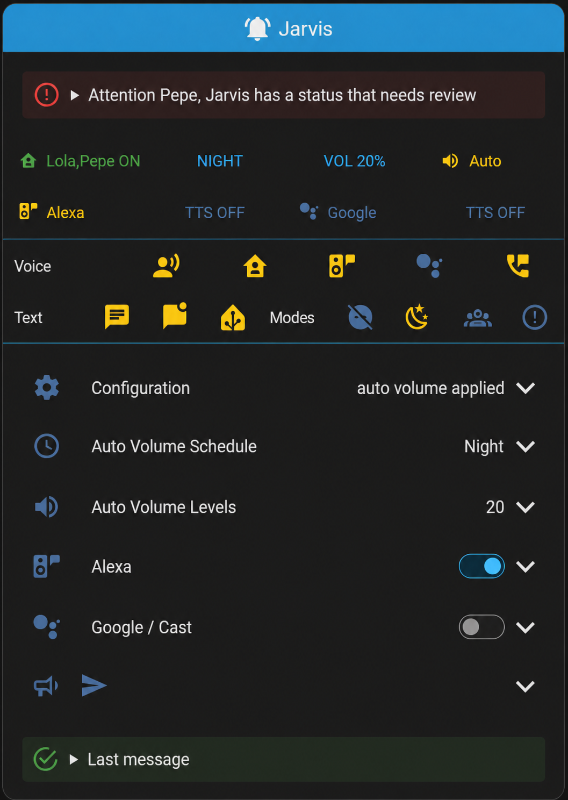

# Notifier Hub for Home Assistant

[English](README.md) | [Espanol](README.es.md)

Home Assistant custom integration for centralizing text notifications, persistent notifications, Alexa, Google/Cast, and phone calls.

It is a native integration conversion of the AppDaemon app [`Centro Notifiche`](https://github.com/caiosweet/Package-Notification-HUB-AppDaemon) / [`Notifier`](https://github.com/jumping2000/notifier). It keeps compatibility with the legacy `notifier` event, but new automations should use the `notifier_hub.send` service.

## Contents

- [Main features](#main-features)
- [Installation](#installation)
- [Global configuration](#global-configuration)
- [Getting started](#getting-started)
- [How each delivery is decided](#how-each-delivery-is-decided)
- [`notifier_hub.send` reference](#notifier_hubsend-reference)
- [Channel guides](#channel-guides)
- [Location and presence](#location-and-presence)
- [Global controls](#global-controls)
- [Auto Volume](#auto-volume)
- [Dashboard](#dashboard)
- [Created entities](#created-entities)
- [Home Assistant events](#home-assistant-events)
- [AppDaemon compatibility](#appdaemon-compatibility)
- [Migration notes](#migration-notes)

## Main features

- `notifier_hub.send` service for sending messages from automations, scripts, or Developer Tools.
- Persistent notifications in Home Assistant.
- Notifications through `notify.*` services: Telegram, `mobile_app`, Pushover, Discord, and generic services.
- Alexa Media Player: TTS, announce, push, media playback, temporary volume, and volume restore.
- Google/Cast: TTS through entities or `tts.*` services, notify mode, media playback, temporary volume, and volume restore.
- Phone calls through the ha-sip add-on.
- Location filtering based on `person.*` entities or a tracker compatible with older setups.
- Switches for enabling or disabling channels, do not disturb mode, guest mode, and priority.
- Auto Volume with editable day periods through `time.*` and `number.*` entities.
- Optional night DND using the `Night` and `Late night` Auto Volume periods.
- Optional notifications for Home Assistant lifecycle events.
- Compatibility with old automations that use `event: notifier`.

## Installation

### Alexa support

Notifier Hub can use the unofficial [Alexa Media Player](https://github.com/alandtse/alexa_media_player) custom component through `notify.alexa_media` and `media_player.*` entities. This mode supports Alexa TTS, announcements, push notifications, media playback, temporary volume changes, and volume restore.

Notifier Hub can also use the official Home Assistant Alexa Devices integration through `notify.send_message` and per-device `notify.*` entities, such as `notify.echo_dot_speak` or `notify.echo_dot_announce`. This mode supports speech/announce delivery, but temporary volume changes, volume restore, push notifications, and media playback remain available only through Alexa Media Player media players.

### HACS

You can install Notifier Hub from HACS as a custom repository:

[](https://my.home-assistant.io/redirect/hacs_repository/?owner=rafaalbelda&repository=notifier_hub&category=integration)

1. Open HACS in Home Assistant.
2. Select the three dots in the top-right corner and open **Custom repositories**.
3. Add `https://github.com/rafaalbelda/notifier_hub`.
4. Select the **Integration** category.
5. Install **Notifier Hub** and restart Home Assistant.
6. Add the integration from:

```text
Settings > Devices & services > Add integration > Notifier Hub
```

### Manual installation

Copy the folder:

```text
custom_components/notifier_hub
```

to:

```text
/config/custom_components/notifier_hub
```

Restart Home Assistant and add the integration from:

```text
Settings > Devices & services > Add integration > Notifier Hub
```

Only one Notifier Hub instance can exist per Home Assistant installation.

The configuration form is organized into these sections:

- Persons
- Notify Services
- Alexa
- Google
- Phone
- Notifications
- Auto Volume

## Global configuration

The recommended configuration method is the UI. You can also import an initial configuration from `configuration.yaml`:

```yaml
notifier_hub:
  personal_assistant: Jarvis
  persons:
    - person.anna
    - person.carlos
  notify_services:
    - notify.mobile_app_my_phone
    - notify.telegram
  alexa_players:
    - media_player.living_room_echo
    - media_player.kitchen_echo
  alexa_notify_entities:
    - notify.living_room_echo_speak
    - notify.kitchen_echo_announce
  google_players:
    - media_player.living_room_google_home
  google_tts_service: tts.google_en_com
  google_notify_service: google_assistant
  sip_server_name: fritz.box:5060
  called_number: "600123456"
  default_language: en-US
  default_volume: 0.30
  tts_wait_time: 3
  text_notifications: true
  screen_notifications: true
  speech_notifications: true
  speech_home_only: false
  alexa_notifications: true
  google_notifications: true
  phone_notifications: false
  ha_event_notifications: true
  ha_event_notify_services:
    - notify.mobile_app_my_phone
  auto_volume: true
  night_dnd: false
  auto_volume_exclude_players:
    - media_player.bedroom_echo
  dnd_entity: switch.notifier_hub_dnd
  guest_mode_entity: switch.notifier_hub_guest_mode
  priority_message_entity: switch.notifier_hub_priority_message
  location_tracker: group.notifier_location_tracker
  install_dashboard: true
```

### Precedence order

Notifier Hub combines global values, runtime options, and data sent with each message.

The effective configuration is resolved in this order:

1. Internal integration defaults.
2. Initial configuration saved when installing the integration or imported from YAML.
3. Runtime options saved from the UI and editable entities. These options override the initial configuration.
4. Parameters sent to `notifier_hub.send`. When an equivalent option exists, the message value overrides the global value only for that call.

The `notifier_hub.set_config` service can temporarily change runtime values without restarting Home Assistant:

```yaml
action: notifier_hub.set_config
data:
  config:
    default_volume: 0.25
```

These changes stay in memory until the configuration is reloaded or the integration is restarted.

### Global fallback values

| Global configuration | Message parameter with priority | Behavior |
|---|---|---|
| `notify_services` | `notify` | With `notify: true`, the global services are used. A service or list in `notify` replaces the global list for that message. |
| `alexa_players` | `alexa.media_player` | If the message does not set Alexa players, the global players are used. |
| `alexa_notify_entities` | `alexa.notify_entity` or `alexa.notify_entities` | If the message does not set Alexa notify entities, the global entities are used. |
| `google_players` | `google.media_player` or `google.player` | If the message does not set Google/Cast players, the global players are used. |
| `default_volume` | `alexa.volume` or `google.volume` | Used when there is no explicit volume and `auto_volume` is disabled. |
| Current `auto_volume` period volume | `alexa.volume` or `google.volume` | When `auto_volume` is enabled, it replaces `default_volume`. An explicit volume has priority over both. |
| `tts_wait_time` | `alexa.wait_time` or `google.wait_time` | The message value replaces the global buffer used before restoring volume. |
| `default_language` | `alexa.language` or `google.language` | The message language replaces the global language. |
| `google_tts_service` | `google.tts_service`, `google.service`, `google.tts_entity` or `google.engine_id` | The engine set in the message replaces the global one. |
| `google_notify_service` | `google.notify_service` | The message service replaces the global one in Google Assistant or notify mode. |
| `called_number` | `called_number` | The message number replaces the global one for that call. |
| `persons` | `location` | `location` defines the required state. If `persons` is empty, `location_tracker` is used as fallback. |

`sip_server_name` can only be configured globally and cannot be overridden per message.

If `speech_home_only` is enabled, voice messages without an explicit `location` behave as if they included `location: home`. A `location` sent with the message has priority.

## Getting started

Notifier Hub is used by calling the `notifier_hub.send` service from an automation, a script, or:

```text
Developer Tools > Actions
```

Before sending messages, configure the `notify.*` services and the Alexa or Google/Cast players you want to use from the UI.

### Text notification

`notify: true` uses the globally configured services in `notify_services`.

```yaml
action: notifier_hub.send
data:
  title: "Door"
  message: "The front door has been opened"
  notify: true
```

### Text and Alexa

```yaml
action: notifier_hub.send
data:
  title: "Washing machine"
  message: "The washing machine has finished"
  notify: true
  alexa: true
```

### Google/Cast

```yaml
action: notifier_hub.send
data:
  message: "Someone is at the door"
  google: true
```

### Urgent message

```yaml
action: notifier_hub.send
data:
  title: "Alarm"
  message: "Alarm triggered"
  notify: true
  alexa: true
  priority: true
```

`priority: true` bypasses switches, location filtering, and do not disturb mode. See [Priority](#priority) before using it with phone calls.

## How each delivery is decided

Global switches are not simple defaults. They work as permissions for each channel.

| Channel | Must be enabled | Message parameter | Filtered by `location` | Blocked by DND |
|---|---|---|---|---|
| Text `notify.*` | `text_notifications` | `notify` | Yes | No |
| Home Assistant persistent notification | `screen_notifications` | Created unless `no_show: true` is used | No | No |
| Alexa | `speech_notifications` and `alexa_notifications` | `alexa` | Yes | Yes |
| Google/Cast | `speech_notifications` and `google_notifications` | `google` | Yes | Yes |
| Phone | `phone_notifications` | `phone` | No | Yes |

For selectable channels, the global option means the channel may be used and the message means you want to use it for that call. For example, Alexa is only used when `alexa_notifications` is enabled and the message includes `alexa: true` or an `alexa:` dictionary.

| Channel global | Message value | Normal result |
|---|---|---|
| `true` | `true` or active dictionary | The channel is used |
| `true` | `false` or missing | The channel is not used |
| `false` | `true` or active dictionary | The channel is not used |
| `false` | `false` or missing | The channel is not used |

Priority can bypass global blocks, `location`, and DND, but it does not turn a disabled channel selector into an active one. See [Priority](#priority) for the exact exceptions.

Example: this message uses the global notify services, limits Alexa to a specific player, and temporarily overrides the global or automatic volume:

```yaml
action: notifier_hub.send
data:
  title: "Door"
  message: "The front door has been opened"
  location: home
  notify: true
  alexa:
    media_player: media_player.living_room_echo
    volume: 0.45
```

Alexa only speaks if the speech and Alexa switches are enabled, DND is off, and the location matches, unless priority or guest mode creates an exception.

### Voice only when someone is home

Enable `speech_home_only` or the switch:

```text
switch.notifier_hub_speech_home_only
```

When enabled, Alexa and Google/Cast assume `location: home` if an action does not include `location`. This lets you globally silence speech when nobody is home without repeating `location: home` in every automation.

An explicit `location` in the message has priority. For example, `location: office` still checks for `office`.

This filter only affects speech. It does not filter text notifications, persistent notifications, or phone calls.

### Do not disturb

The entity configured in `dnd_entity` blocks Alexa, Google/Cast, and phone calls when it is `on`.

By default it uses:

```yaml
dnd_entity: switch.notifier_hub_dnd
```

You can also automatically enable DND during the `Night` and `Late night` Auto Volume periods with:

```yaml
night_dnd: true
```

or from the entity:

```text
switch.notifier_hub_night_dnd
```

When enabled, Notifier Hub applies DND while `sensor.notifier_hub_day_period` matches the `Night` or `Late night` periods. The start is configured with `time.notifier_hub_night_start` and `time.notifier_hub_late_night_start`; it ends when the next Auto Volume period starts. The manual `switch.notifier_hub_dnd` keeps working independently.

Text notifications and persistent notifications keep working.

### Guest mode

The entity configured in `guest_mode_entity` allows Alexa and Google/Cast to speak even when `location` does not match.

By default it uses:

```yaml
guest_mode_entity: switch.notifier_hub_guest_mode
```

This is useful when guests are at home. It does not bypass do not disturb mode and does not affect phone calls.

### Priority

General priority can be enabled with `priority: true` in the message or by turning on the entity configured in `priority_message_entity`:

```yaml
priority_message_entity: switch.notifier_hub_priority_message
```

`switch.notifier_hub_priority_message` turns off automatically after the next message is processed.

Special rules:

- General priority bypasses switches, `location`, and DND.
- It also forces the persistent notification even when `no_show: true` exists.
- For text, Alexa, and Google/Cast, general priority does not replace the channel selector: `notify: false`, `alexa: false`, or `google: false` still prevents that delivery.
- For phone, general priority attempts the call even if `phone` is `false`. If a global number exists and you do not want priority phone calls, avoid general priority or remove the global number.
- `alexa.priority: true` and `google.priority: true` bypass blocks only for that speech channel.

## `notifier_hub.send` reference

### General parameters

| Field | Type | Default value | Description |
|---|---|---|---|
| `message` | string | Required | Main message text. |
| `title` | string | `""` | Notification title. |
| `notify` | boolean, string, or list | `true` | Sends text through `notify.*`. With `true`, it uses `notify_services`. Also accepts a service, a list, or a comma-separated string. |
| `no_show` | boolean | `false` | With `true`, avoids creating the persistent notification. |
| `priority` | boolean | `false` | Enables general priority. |
| `location` | string | `""` | Required state for channels subject to location filtering. An empty value applies no filter. |
| `alexa` | boolean or dictionary | `false` | Requests Alexa for this message. Requires `speech_notifications` and `alexa_notifications` to be enabled, except with priority. A dictionary customizes delivery. |
| `google` | boolean or dictionary | `false` | Requests Google/Cast for this message. Requires `speech_notifications` and `google_notifications` to be enabled, except with priority. A dictionary customizes delivery. |
| `phone` | boolean | `false` | Requests a call through ha-sip. The channel must be enabled or the message must be priority. |
| `called_number` | string | Global configuration | Number called by ha-sip. Overrides the global number. |
| `image` | string | `""` | Image for Telegram, Pushover, Discord, or `mobile_app`. Can be a local path or URL depending on the service. |
| `caption` | string | `""` | Telegram photo caption. If empty, it is generated from the title and message. |
| `link` | string | `""` | Link added to the text. In Discord with `embed`, it is used as the embedded content URL. In the UI it appears as **Link**. |
| `target` | string or list | `""` | Specific target passed to `notify.*`, for example one or more Telegram chats. |
| `html` | boolean | `false` | Enables HTML formatting for Telegram and renders the title in bold. |

### Provider-specific `notify.*` payloads

These fields allow provider-specific options:

| Field | Type | Description |
|---|---|---|
| `telegram` | dictionary | Additional payload for Telegram. With `html: true`, it adds `parse_mode: html`. |
| `pushover` | dictionary | Additional payload for Pushover. Automatically receives `image` and `priority` when set. |
| `mobile` | dictionary | Additional payload for `notify.mobile_app_*`. With `tts: true`, it sends the text through `tts_text`. |
| `discord` | dictionary | Additional payload for Discord. If it includes the `embed` key, it uses `title`, `description`, `link`, and `image` to create embedded content. |

### `alexa` options

When `alexa` is a dictionary, it accepts:

| Field | Default value | Description |
|---|---|---|
| `media_player` | `alexa_players` | Player, list, group, friendly name, or `all`. |
| `notify_entity` / `notify_entities` | `alexa_notify_entities` | Entity-based Alexa Devices targets called with `notify.send_message`. |
| `message` | General `message` | Text to play. |
| `message_tts` | Alexa `message` | Alternative TTS text with priority over `message`. |
| `title` | General `title` | Title used for push. |
| `volume` | Current Notifier Hub volume | Temporary volume between `0.0` and `1.0`. |
| `wait_time` | `tts_wait_time` | Additional buffer before restoring volume. |
| `type` | `tts` | Accepts `tts`, `announce`, `push`, `dropin`, or `dropin_notification`. |
| `method` | `all` | Method used with `type: announce`. |
| `push` | `false` | Forces a push notification. |
| `priority` | `false` | Bypasses blocks only for Alexa. |
| `notifier` | `notify.alexa_media` | Alternative Alexa Media Player notify service. |
| `ssml` | `false` | Enables SSML tag generation. |
| `voice` | `Alexa` | Alternative SSML voice. |
| `language` | `default_language` | SSML language. |
| `audio` | `""` | URL or `<audio>` SSML tag inserted before the message. |
| `rate` | `100` | SSML speech rate percentage. |
| `pitch` | `0` | SSML pitch percentage. |
| `ssml_volume` | `0` | SSML volume adjustment in dB. |
| `whisper` | `false` | Enables SSML whisper mode. |
| `media_content_id` | `""` | URL or media identifier played instead of TTS. |
| `media_content_type` | No fixed value | Media content type. |
| `extra` | `0` | `timer` value sent when playing media content. |
| `auto_volumes` | `false` | Adjusts volume without playing TTS. |

### `google` options

When `google` is a dictionary, it accepts:

| Field | Default value | Description |
|---|---|---|
| `media_player` | `google_players` | Player, list, group, or friendly name. Also accepts the `player` alias. |
| `message` | General `message` | Text to play. |
| `volume` | Current Notifier Hub volume | Temporary volume between `0.0` and `1.0`. |
| `wait_time` | `tts_wait_time` | Additional buffer before restoring volume. |
| `language` | `default_language` | TTS engine language. |
| `tts_service` | `google_tts_service` | Modern `tts.*` entity or legacy service. Also accepts the `service` alias. |
| `tts_entity` | `""` | Explicit modern `tts.*` entity. Also accepts the `engine_id` alias. |
| `mode` | `tts` | Uses `tts`, `notify`, `assistant`, or `google assistant`. Also accepts the `type` alias. |
| `notify_service` | `google_notify_service` | Service used in Google Assistant or notify mode. |
| `priority` | `false` | Bypasses blocks only for Google/Cast. |
| `media_content_id` | `""` | URL or media identifier played instead of TTS. |
| `media_content_type` | `music` | Media content type. |

## Channel guides

### Text notifications

`notify: true` sends the message to all services configured in `notify_services`.
You can also set specific services:

```yaml
action: notifier_hub.send
data:
  title: "Notice"
  message: "Test message"
  notify:
    - notify.telegram
    - notify.mobile_app_my_phone
```

### Telegram with HTML, link, and target

```yaml
action: notifier_hub.send
data:
  title: "Camera"
  message: "Motion <b>detected</b>"
  notify: notify.telegram
  target:
    - "123456789"
  link: "https://example.com/camera"
  html: true
```

### Telegram with image

```yaml
action: notifier_hub.send
data:
  title: "Camera"
  message: "Motion detected"
  notify: notify.telegram
  image: /config/www/camera.jpg
  caption: "Motion detected"
```

### Alexa

```yaml
action: notifier_hub.send
data:
  title: "Door"
  message: "The front door has been opened"
  notify: true
  alexa:
    media_player:
      - media_player.living_room_echo
    type: tts
    volume: 0.35
```

### Google/Cast

For recent installations, use the `tts.*` entity created by Google Translate, for example `tts.google_en_com`.

```yaml
action: notifier_hub.send
data:
  title: "Notice"
  message: "Message sent through Google Cast"
  notify: false
  google:
    media_player: media_player.living_room_google_home
    volume: 0.35
    tts_service: tts.google_en_com
```

`google_tts_service` defines the global TTS engine:

```yaml
google_tts_service: tts.google_en_com
```

When you send `google: true`, Notifier Hub generates audio with that engine and plays it on `google_players`.
You can also override it per message with `google.tts_service`.

The legacy `google_translate_say` value is still supported if you use the legacy `tts.google_translate_say` service. If a modern entity exists, Notifier Hub tries to use it automatically.

You can also play media content:

```yaml
action: notifier_hub.send
data:
  title: "Audio"
  message: ""
  notify: false
  google:
    media_player: media_player.living_room_google_home
    media_content_id: "https://example.com/audio.mp3"
    media_content_type: music
```

### Phone calls

```yaml
action: notifier_hub.send
data:
  title: "Alert"
  message: "Alarm triggered"
  phone: true
  called_number: "+34600000000"
```

Calls are sent through the ha-sip add-on from [`arnonym/ha-plugins`](https://github.com/arnonym/ha-plugins). The integration does not place the call directly: it sends the destination and text to the add-on with `hassio.addon_stdin`.

The expected add-on is `ha-sip`, internally identified as:

```text
c7744bff_ha-sip
```

Notifier Hub builds a SIP URI with this format:

```text
sip:<called_number>@<sip_server_name>
```

For example:

```yaml
sip_server_name: fritz.box:5060
called_number: "600123456"
```

generates:

```text
command: dial
number: sip:600123456@fritz.box:5060
menu:
  message: <message>
  post_action: hangup
```

The default value `fritz.box:5060` is intended for a FRITZ!Box router using the standard SIP port `5060`.

ha-sip requires a Home Assistant installation with Supervisor and add-ons. In Home Assistant Core or Container without Supervisor, `hassio.addon_stdin` does not exist.

## Location and presence

`location` filters text, Alexa, and Google/Cast according to presence. It does not filter persistent notifications or phone calls.

The recommended configuration is to use `persons`:

```yaml
persons:
  - person.anna
  - person.carlos
```

With `location: home`, the message passes if at least one configured person is `home`:

```yaml
action: notifier_hub.send
data:
  title: "Home notice"
  message: "Motion detected"
  location: home
  alexa: true
```

If `persons` is empty, Notifier Hub uses `location_tracker` as fallback:

```yaml
location_tracker: group.notifier_location_tracker
```

In that case, it compares `location` with the configured entity state. If the message does not include `location`, no filter is applied.

Aggregated presence entities:

| Entity | State | Useful attributes |
|---|---|---|
| `sensor.notifier_hub_home_people` | Number of configured people currently `home` | `total_count`, `away_count`, `is_home`, `home_persons`, `home_person_names`, `home_person_details`, `away_persons`, `away_person_names`, `away_person_details`, `persons` |
| `binary_sensor.notifier_hub_home_occupied` | `on` if at least one configured person is `home` | `home_count`, `total_count`, `home_persons`, `home_person_names`, `home_person_details`, `away_persons`, `away_person_names`, `away_person_details` |

To show people on a map, use the original `person.*` entities. The aggregated entities summarize presence, but they do not represent a single position.

## Global controls

Notifier Hub creates switches that can be used from the UI, dashboard, or automations:

| Entity | Configuration | Use |
|---|---|---|
| `switch.notifier_hub_text_notifications` | `text_notifications` | Notifications through `notify.*`. |
| `switch.notifier_hub_screen_notifications` | `screen_notifications` | Persistent notifications. |
| `switch.notifier_hub_speech_notifications` | `speech_notifications` | Master speech switch. |
| `switch.notifier_hub_speech_home_only` | `speech_home_only` | If an action does not include `location`, allow speech only when someone is `home`. |
| `switch.notifier_hub_alexa_notifications` | `alexa_notifications` | Alexa TTS, announce, and push. |
| `switch.notifier_hub_google_notifications` | `google_notifications` | Google/Cast TTS or notify. |
| `switch.notifier_hub_phone_notifications` | `phone_notifications` | Phone calls. |
| `switch.notifier_hub_home_assistant_event_notifications` | `ha_event_notifications` | Home Assistant lifecycle notices. |
| `switch.notifier_hub_auto_volume` | `auto_volume` | Automatic volume by day period. |
| `switch.notifier_hub_dnd` | `dnd_mode` | Do not disturb mode. |
| `switch.notifier_hub_night_dnd` | `night_dnd` | Automatically applies DND during the `Night` and `Late night` Auto Volume periods. |
| `switch.notifier_hub_guest_mode` | `guest_mode` | Allows speech when `location` does not match. |
| `switch.notifier_hub_priority_message` | `priority_message` | Forces priority for the next message. |

## Auto Volume

Auto Volume adjusts the configured Alexa and Google players according to the current day period.

When `auto_volume` is enabled:

- Alexa and Google messages without an explicit `volume` use the current period volume.
- An explicit message `volume` has priority.
- The integration periodically updates the volume of the configured players.
- `auto_volume_exclude_players` excludes specific players.
- `night_dnd` can reuse the `Night` and `Late night` periods to automatically enable DND.

Default periods:

| Period | Start | Volume |
|---|---:|---:|
| Late night | `01:00` | `10%` |
| Early morning | `05:00` | `20%` |
| Morning | `07:00` | `30%` |
| Afternoon | `12:00` | `40%` |
| Evening | `18:00` | `30%` |
| Night | `22:00` | `20%` |

The dashboard includes:

- `sensor.notifier_hub_day_period`
- `sensor.notifier_hub_day_period_volume`
- `time.notifier_hub_*_start` entities for editing the start of each period.
- `number.notifier_hub_*_volume` entities for editing the volume of each period.

If `switch.notifier_hub_night_dnd` is enabled, the `Night` and `Late night` periods are also used as a do not disturb window for speech and phone calls.

## Dashboard

The `notifier_hub_dashboard.yaml` file includes a Lovelace panel with status, TTS activity, test buttons, channels, and Auto Volume controls.

The `install_dashboard` option automatically copies the panel to:

```text
/config/notifier_hub_dashboard.yaml
```

It also creates a persistent notification with the block you need to add to `configuration.yaml`:

```yaml
lovelace:
  dashboards:
    notifier-hub:
      mode: yaml
      title: Notifier Hub
      icon: mdi:bell-ring
      show_in_sidebar: true
      filename: notifier_hub_dashboard.yaml
```

If you do not use `install_dashboard`, you can manually copy `notifier_hub_dashboard.yaml` to `/config/notifier_hub_dashboard.yaml` and register the same block.

### Compact Card Example

A ready-to-use compact Lovelace card is available at [samples/notifier_hub_compact_card_no_browser_mod_en.yaml](samples/notifier_hub_compact_card_no_browser_mod_en.yaml). It is meant to be pasted inside `cards:` in an existing Lovelace view and does not require Browser Mod.



## Created entities

### Sensors

| Entity | Use |
|---|---|
| `sensor.notifier_hub_debug` | Debug status and error details. |
| `sensor.notifier_hub_last_message` | Last processed message. |
| `sensor.notifier_hub_personal_assistant` | Configured assistant name. |
| `sensor.notifier_hub_home_people` | Number and details of people at home. |
| `sensor.notifier_hub_day_period` | Current Auto Volume period. |
| `sensor.notifier_hub_day_period_volume` | Volume for the current period. |

### Binary sensors

| Entity | Use |
|---|---|
| `binary_sensor.notifier_hub_alexa_speak` | Indicates whether Alexa is processing speech. |
| `binary_sensor.notifier_hub_google_speak` | Indicates whether Google/Cast is processing speech. |
| `binary_sensor.notifier_hub_home_occupied` | Indicates whether at least one configured person is home. |

The `time.notifier_hub_*_start` and `number.notifier_hub_*_volume` entities edit Auto Volume.
See [Global controls](#global-controls) for the switches.

## Home Assistant events

Notifier Hub can notify the events equivalent to `Start`, `Final Write`, `Close`, `Stop`, and `Restart` from the original app:

- `homeassistant_started`
- `homeassistant_final_write`
- `homeassistant_close`
- `homeassistant_stop`
- Calls to the `homeassistant.restart` service

Enable or disable them with `ha_event_notifications` or `switch.notifier_hub_home_assistant_event_notifications`.

By default it uses `notify_services`. To separate internal notices from normal messages, configure `ha_event_notify_services`:

```yaml
notify_services:
  - notify.telegram
  - notify.mobile_app_my_phone

ha_event_notify_services:
  - notify.mobile_app_my_phone
```

If `ha_event_notify_services` is empty, `notify_services` is used as fallback.

## AppDaemon compatibility

Notifier Hub listens to the custom `notifier` event to keep compatibility with old automations created for the original AppDaemon app.

The `event_data` is processed the same way as data sent through `notifier_hub.send`:

```yaml
event: notifier
event_data:
  title: "Washing machine"
  message: "The washing machine has finished"
  notify: true
  alexa:
    media_player: media_player.living_room_echo
    type: announce
    method: all
    volume: 0.4
```

For new automations, call the service directly:

```yaml
action: notifier_hub.send
data:
  title: "Washing machine"
  message: "The washing machine has finished"
  notify: true
```

## Migration notes

- Where `script.my_notify` was used before, `notifier_hub.send` can now be used.
- Where `event: notifier` was fired before, it can stay in place during migration.
- Old helper entities (`input_boolean`, `input_select`, etc.) are no longer required.
- If you want to keep your own entities for do not disturb, guests, or priority, set them with `dnd_entity`, `guest_mode_entity`, and `priority_message_entity`.
- Google/Cast has been added as a native manager. Use `google: true` or a `google:` dictionary.

## Changes from AppDaemon

Removed:

- Automatic package download from GitHub.
- Group management created by AppDaemon.
